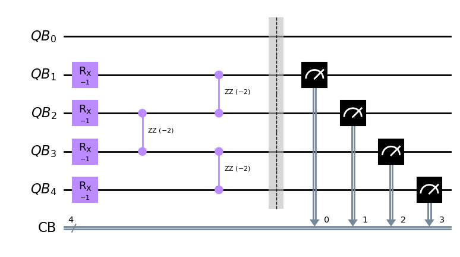

# Solving Ising model with Qiskit

An introduction to Qiskit is presented by me and Lukas Helmig at the University of Cologne. The magnetization of the Ising model is examined on real IBM quantum computers and on their simulators. 
